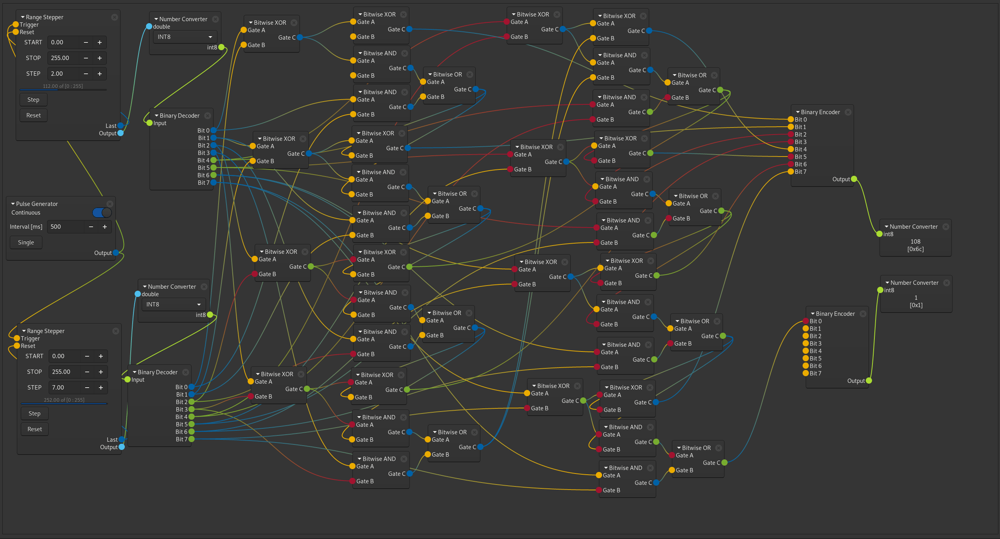
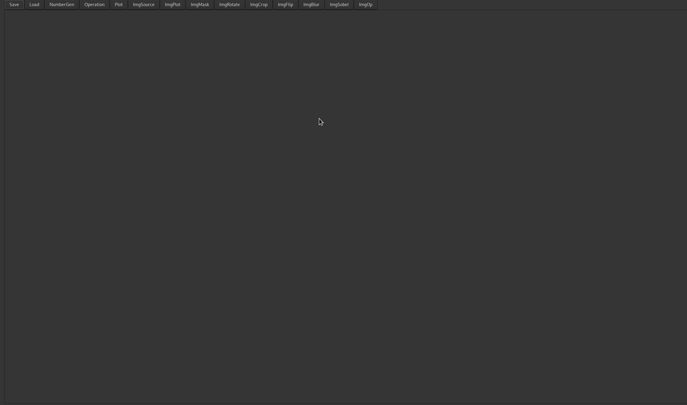

# GtkNodes

This library provides a (hopefully) easy-to-use interface for the creation
of functional flow graphs with the ablility to pass arbitrary data
between connected elements.

The flow graph is managed in NodeView, which is a graphical connection manager
for the graph's functional element (Nodes). Nodes are custom GtkWidget
containers (derived from GtkBox), which hold one or more items (i.e. other
widgets). When a widget is added to a node, it will be assigned a NodeSocket,
which represents (and manages) the actual connectivity between nodes.

A NodeSocket can be configured in one of 3 modes: SINK, SOURCE and DISABLE.
SINKs accept a single input and are connected to a SOURCE by a drag-and-drop
operation from a source socket to a sink socket. SOURCEs can have an arbitrary
number of connected outputs.
A socket in SINK mode will be displayed vertically centered to its associated
widget and on the left edge of the node, while sockets in SOURCE mode are
drawn on the right edge of the node. Sockets in mode DISABLE are simply not
drawn.

Existing connections can be modified in the NodeView by drag and drop.
If a connected sink receives a new connection from a source, it will disconnect
from its previous source and connect to the new input.
If a drag operation is started on top of a connected sink, its source will be
disconnected and the drag event will be redirected to the source, just as if
the user had initiated the drag event on the source.
This method is also how the user would drop an existing connection between
nodes: by starting the drag on the sink and then simply aborting the drag.

In order to ensure (data format) compatbility between nodes, a numerical
key can be configured. If the key changes, or a connection to a socket with an
incompatible key is attempted, the connection will be either dropped or rejected.
A key value of 0 for sinks is special, in that they will accept any input.

In order to visualize compatible sockets, an RGBA value can be set.


## Nodes

The Node widget is a widget container drived from #GtkBox.
Widgets added to the node are assigned a NodeSocket. The user must
configure the type of socket and connect to the *socket-incoming* signal
in order to be able to receive the data passed through a connection.

The Node can be collapsed by clicking the #GtkExpander which will hide the
node items, and show a compact representation of the node with just the
GtkExpander and the sockets visible.


## Data Exchange

To receive data on a socket, connect to the "socket-incoming" signal
just as you would for any other Gtk/Glib signal.

All data are passed encapsulated in a GByteArray in order to accomodate arbitrary formats
and also so that Nodes can be introspected and used with other languages.

To write data on a socket, a function is provided which requires the
socket reference (can be retrieved when adding an item to a Node) and a
GByteArray as input.


## Ability to save and restore graphs

All reconstruction of graphs is handled by GtkBuilder. This means that
all individual nodes must be implemented as subclasses of the Node widget,
so GtkBuilder can locate, create and add them to a node view.

The NodeView widget provides load/store functions for this purpose.

### Internal states

Custom GtkNodesNode widgets can save and restore their internal child
widget states and other properties and special tags by implementing
the proper GtkBuildable interfaces. To export the configuration,
node_export_properties() must be implemented and is expected to return
valid xml output which is integrated into the xml output produced
by #GtkNodesNodeView.

For example, to restore the value of an internal spin button widget,
the function would return an allocated string containing:

```xml
<child internal-child="spinbutton">
     <object class="GtkSpinButton">
     	<property name="value">5</property>
     </object>
</child>
```

The weird thing is that GtkBuilder apparently wants to add the internal
children to the GtkNode widget, even though the "internal-child" property is
set. This obviously fails, resulting in a warning message,
however the restoration of the child's property succeeds. I have not
yet figured out, why this is the case, maybe this requires another builder
class function to be implemented, or I may have misunderstood the intention
of "internal-child".

Example nodes demonstrating this functionality are found in examples/nodes/node_step.c for
the C demonstrator and in class NumberNode for the Python demo (examples/img.py).


# API

You can find a gtkdoc rendering of the API [here](https://uviespace.univie.ac.at/gtknodes/index.html).


# Screenshots

From the C demo: an 8-bit binary adder with 9 bits of output




The Python example: applying image filters using NumPy, SciPy and Matplotlib
plus a random calculator node controlling plot parameters




An actual use case: freely programmable observations for my radio telescope
control software. The nodes integration is only preliminary, but what
can already be constructed very easily in this example is a grid observation
program in a celestial coordinate system (Horizon, Equatorial or Galactic)
and the application of a filter to the spectral data received by the telescope.

If you want to try it for yourself, see [radtel](https://github.com/aluntzer/radtel).
The nodes support is still incomplete, you can find it on the *gtknodes* branch.


# Building

If you want to use this library from python or any other language using
gobject introspection bindings, make sure the build tools (g-ir-scanner,
g-ir-compiler). If bindings are still not generated, enable introspection
explicitly:


```
./configure --enable-introspection=yes

```

If you want to try the python example without installing the library system-wide,
make sure to export the proper paths, i.e. from the examples/ subdirectory
run the demo like this:

```
GI_TYPELIB_PATH=../introspection/ LD_LIBRARY_PATH=../src/.libs python img.py
```


# Build dependencies 

Ubuntu:

```
sudo apt install \
  gobject-introspection \
  gtk-doc-tools \
  libtool \
  autoconf \
  automake \
  libgladeui-dev \
  libgirepository1.0-dev

```

# Packages

Arch Linux:

Available in AUR as [gtknodes-git](https://aur.archlinux.org/packages/gtknodes-git/)


# Notes

- I realise that this description is be a bit brief at this time, but you may
  want to check the examples subdirectory for implementations of a NodeView
  and Nodes in both C and Python. These examples cover pretty much every
  aspect of this library.

- While possible, using a GtkNodesNode outside of a GtkNodesNodeView does 
  not make much sense.

- The placement of sockets is currently only properly supported for the
  GTK_ORIENTATION_VERTICAL orientation

- If the nodes and node viewer seem familiar to you, note that they were
  heavily inspired by how nodes work in Blender.

- I realize that there are lot of features you might want to see right now,
  such as snap-to-grid, auto-layout, zoomability, or one thing I'd like to
  have in the near future: collapsible node groups (essentially a Node with a
  NodeView inside). All of this will have to wait bit, unfortunately, I'll be
  short on time for a while. I accept patches though :)


# Licensing

GtkNodes is released under the terms of the GNU Lesser General Public License,
version 2.1 or, at your option, any later version, as published by the Free
Software Foundation.

Please, see the [`COPYING`](./COPYING) file for further information.
